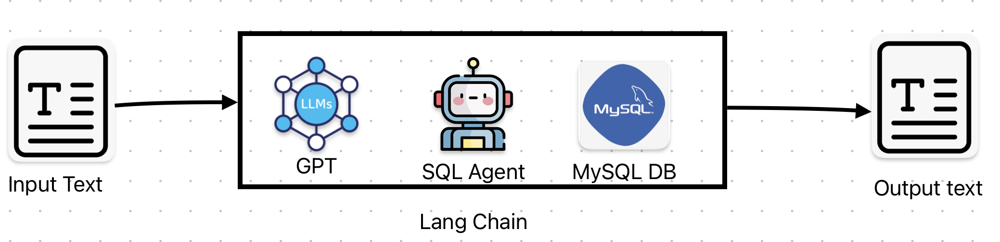
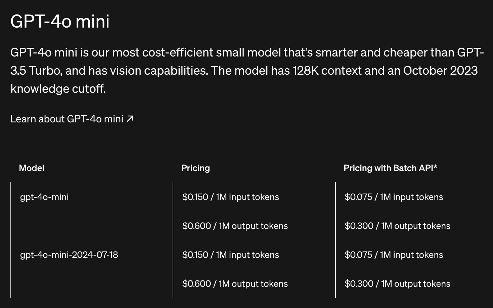
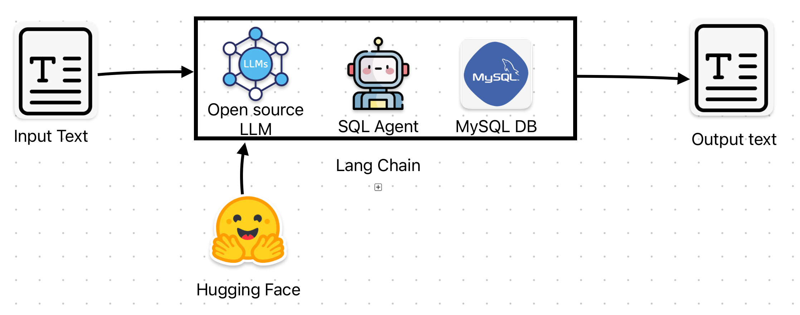

# Hospital chatbot 

The following project is focused on the development of a chatbot based on language models. The use case is centered around a hospital chatbot. The users of this chatbot are the doctors and nurses of the hospital, and the value that the chatbot will provide is the ability to quickly supply them with information about the patients such as:

- Medical History
- Medical Appointments
- General Patient Information

## 1) First architecture: 

The proposal of the first architecture is shows in the following image:

  

### 1.1) Input text 

The input text or prompt for a large language model (LLM) represents the initial text that is given to the model to generate a response. 
This prompt provides context and specific instructions on how the model should respond.

### 1.2) GPT Model 
The solution that was proposed is based on the integration of a payment model LLM, specifically a model from the OpenAI company, the GPT4 o-mini version.
The main reasons why it was decided to choose this model and this approach to using a paid model are the following:

- **Easy update:** A paid model will have a quick update in the code, unlike an open source model that may have greater demands for modifications in the code.
 

 - **Ease of integration**: Normally the models that perform best in their integration with development frameworks such as Langchhain are the paid models.

Moreover, the choice of the model GPT4 o mini response to the reason that his model [is the most cost-efficient](https://openai.com/api/pricing/) model currently in OpenAI,
and it is  smarter and cheaper than GPT-3.5 Turbo. The following image shows the pricing of this model: 

<table style="width:100%; text-align:center;">
  <tr>
    <td>
      
    </td>
  </tr>
</table>

### 1.3) SQL Agent

Another relevant component of the general workflow is the agent. 
In LangChain, an "agent" is an entity used to handle complex tasks and perform multiple steps in an automated manner within an application that employs language models. 
Agents in LangChain allow developers to create dynamic workflows that can interact with **different tools, databases, and APIs, facilitating the execution of tasks in a sequential and coordinated manner.**

In simple words, an agent in LangChain is an entity capable of carry out actions base on natural langauge. It is an extremely useful feature that open the door to countless applications.
In this context, an agent loaded with sql tools is proposed to be use. 

### 1.4) MySql DataBase 
**The fictional** information of the Hospital, such as their medical history, appointments, and general information, will be stored in a relational database, specifically in a MySQL database.
The SQL file for creating the database can be found in the repository with the name of **Fake_Hospital_DB.sql**.
 
MySQL was chosen because it is a popular relational database, powerful and with a free version that provides extensive data management and storage capabilities.

### 1.5) Output text 
Finally, the output text is the agent's response to the user's request.

## 2)  Second architecture
The second architecture is very similar to the first. The main difference is that it will use an open source LLM. 
This architecture will not be analyzed in much detail. The reasons why this option was not chosen will simply be mentioned. 
The general structure of this architecture is presented below:

<table style="width:100%; text-align:center;">
  <tr>
    <td>
      
    </td>
  </tr>
</table>
The idea is to integrate some open source language model. This can be done from huggingface which is a famous repository of models mainly based on transformers. Including language models.

Using langchain is an advantage in this sense because it is a unified framework in which you can integrate different models.

## 3) Discussions of the choice of architecture

### 3.1) Pros of Using a Paid Model (GPT-4o Mini)

1. **Easy Updates:**
   - Paid models, such as GPT-4o Mini, receive regular updates and improvements directly from the provider, ensuring that the model remains up-to-date with the latest advancements in AI technology. This reduces the need for extensive manual adjustments and maintenance.
   
2. **Ease of Integration:**
   - Paid models often come with robust support and seamless integration capabilities with development frameworks like LangChain. This can significantly reduce the time and effort required to integrate the model into the application, leading to faster deployment.

3. **Cost-Efficiency:**
   - GPT-4o Mini is marketed as a cost-efficient model, being both smarter and cheaper than alternatives like GPT-3.5 Turbo. This provides a good balance between performance and cost, making it an economical choice for production use.

4. **Performance and Reliability:**
   - Paid models from established providers like OpenAI tend to offer superior performance in terms of response accuracy, processing speed, and handling complex queries. This reliability is crucial for applications in sensitive environments like hospitals.

### 3.2) Cons of Using a Paid Model (GPT-4o Mini)

1. **Cost:**
   - While GPT-4o Mini is cost-efficient compared to some models, it still incurs ongoing subscription costs. These costs can add up, especially with high usage, making it more expensive than using a completely free open-source model.

2. **Vendor Lock-In:**
   - Relying on a paid model can lead to dependency on a single vendor. Any changes in pricing, service availability, or terms of use from the provider could impact the application significantly. 

3. **Less Control:**
   - With paid models, you have less control over the model itself compared to open-source alternatives. Customizing the model to meet specific requirements or integrating specific datasets may be more challenging.

### 3.3) Conclusion

The decision to use GPT-4o Mini in the hospital chatbot project provides several advantages, such as easy updates, seamless integration, cost-efficiency, and reliable performance. However, it also introduces considerations related to ongoing costs, potential vendor lock-in, and reduced control over the model. Balancing these factors is crucial to ensure that the chosen architecture aligns with the project's goals and resource constraints.
As part of this demo a private model was choosen.

## 4) Beyond this demo 

While this demo is functional, as it is capable of providing specific information from a database based on a natural language request, there are still critical aspects to consider before launching such a tool into production.

Some of the aspects that need to be evaluated **for a real world application** are the following:

- What other capabilities will the tool have? Should it have memory? Should it be able to process unstructured data?
- Conduct a deeper evaluation in terms of using a paid model vs. an open-source model. The latest releases of open-source models rival the performance of private models, so it is important to conduct an economic and quality assessment of the solution to determine which is more convenient.
- Where will the application live? It is important to know in what environment the application will be hosted. With public cloud providers like GCP, Azure, or AWS, it is possible to host these solutions. The final architecture should be designed for the real use case.

With these aspects better evaluated, it would be possible to carry out a more complete development of the application that allows the deployment of the tool in production.

